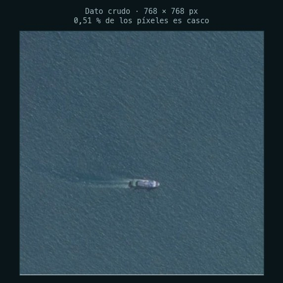
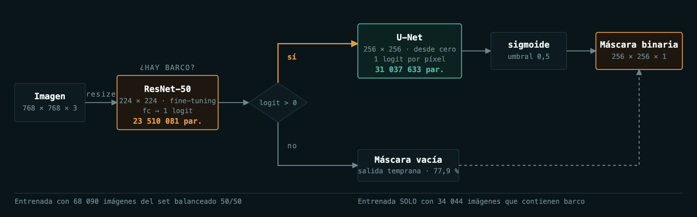
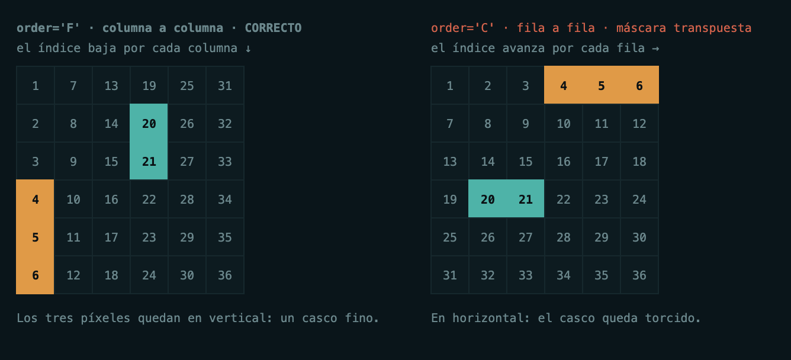
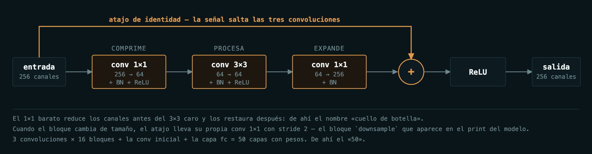
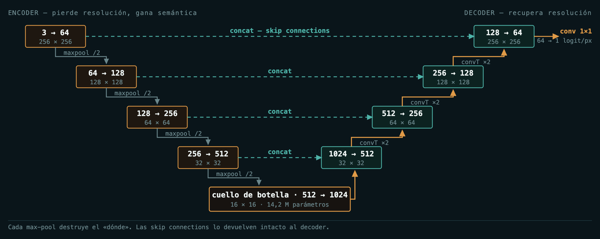
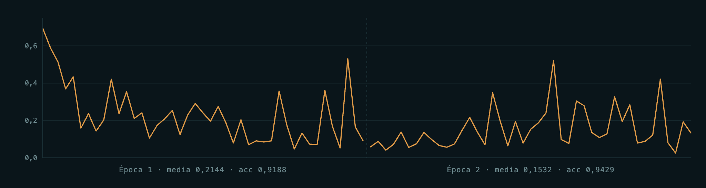
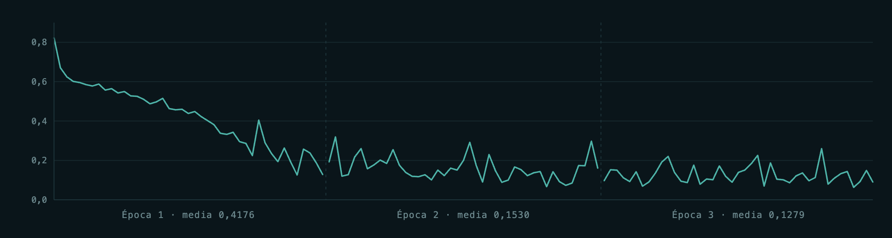
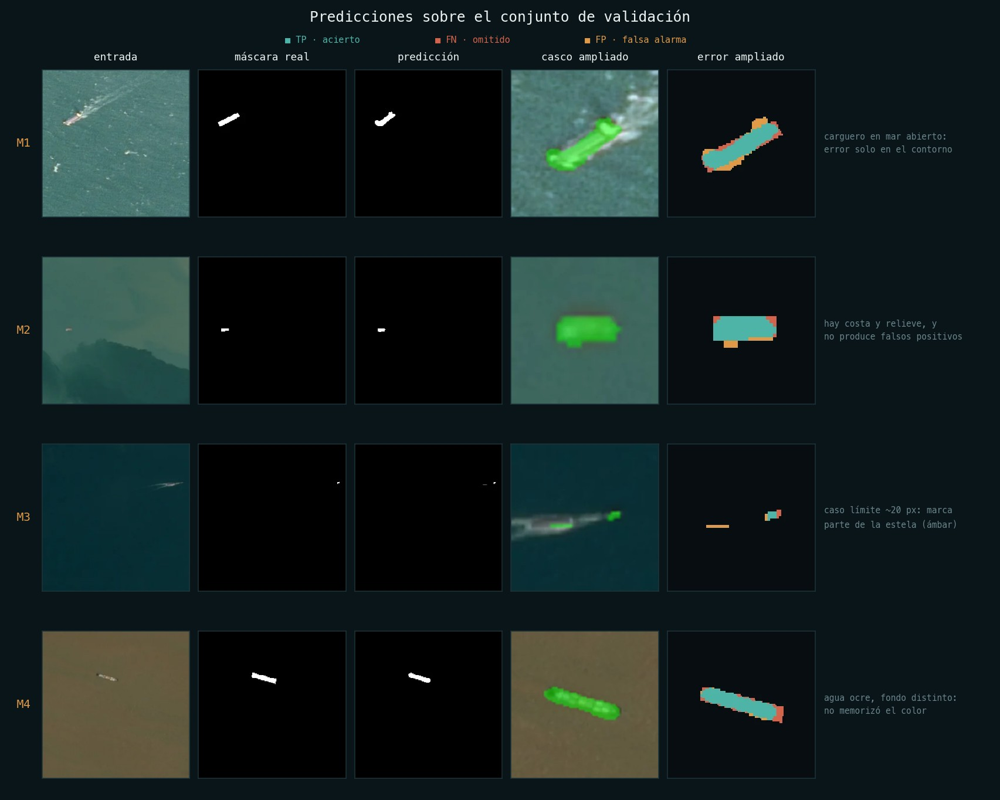

# Detección y segmentación de barcos en imágenes satelitales

Solución al **Airbus Ship Detection Challenge** (Kaggle) en PyTorch: dos redes
encadenadas en cascada que reciben una imagen satelital de 768 × 768 px y
devuelven la máscara de cada casco, píxel a píxel.

**F2 = 0,7726** · Dice = 0,7912 · IoU = 0,6545 sobre 8 512 imágenes de validación.

> Refactorización modular del notebook `Airbus_Segmentation_v3.ipynb`. El
> notebook sigue siendo la memoria del desarrollo; este paquete es el código
> pensado para crecer: configuración externa, componentes desacoplados, tests y
> scripts reproducibles.

---

## Índice

- [El problema](#el-problema)
- [La solución: dos redes en cascada](#la-solución-dos-redes-en-cascada)
- [Instalación](#instalación)
- [Uso](#uso)
- [Estructura del proyecto](#estructura-del-proyecto)
- [Las quince dificultades del camino](#las-quince-dificultades-del-camino)
- [Las redes por dentro](#las-redes-por-dentro)
- [Resultados](#resultados)
- [Configuración](#configuración)
- [Tests](#tests)
- [Qué cambia respecto al notebook](#qué-cambia-respecto-al-notebook)

---

## El problema

Airbus publicó **192 556 imágenes satelitales** de 768 × 768 px y pidió
delimitar cada barco píxel a píxel. No basta con decir «aquí hay un barco»: hay
que devolver la máscara del casco.

| Cifra | Valor |
|---|---|
| Imágenes en el CSV | 192 556 |
| Con al menos un barco | 42 556 · **22,10 %** |
| Sin barco | 150 000 · **77,90 %** |
| Píxeles de casco por imagen | ~337 de 65 536 · **0,51 %** |
| Métrica oficial | **F2** |

El objeto que hay que encontrar ocupa **uno de cada 194 píxeles**. Ese desbalance,
que aquí se ve a simple vista, es el hilo conductor de casi todas las decisiones
de diseño del proyecto.



### Por qué F2 y no accuracy

F2 pondera el **recall cuatro veces más** que la precisión:

```
F2 = 5·TP / (5·TP + 4·FN + FP)
```

En vigilancia marítima, omitir un barco es mucho peor que dar una falsa alarma:
el falso positivo cuesta una revisión humana, el falso negativo cuesta el barco.

### El formato de entrada

Los datos no llegan como pares imagen/máscara. Llegan como un CSV con dos
columnas, `ImageId` y `EncodedPixels`, donde la segunda es **texto plano**: la
máscara comprimida en Run-Length Encoding. Si la imagen no tiene barco, la celda
está vacía.

---

## La solución: dos redes en cascada

El enunciado esconde **dos tareas de granularidad incompatible**:

- «¿Hay barco?» → *una* respuesta por imagen.
- «¿Dónde está?» → *65 536* respuestas por imagen.

Piden resoluciones, funciones de pérdida y regímenes de entrenamiento distintos,
así que se resuelven por separado.



**La puerta no es una optimización, es un requisito.** El clasificador se entrena
sobre un conjunto equilibrado (mitad con barco, mitad sin); la U-Net se entrena
**únicamente con las 42 556 imágenes que contienen barco**, así que nunca ha
tenido que aprender a devolver una máscara vacía. Sin el clasificador delante,
alucinaría cascos sobre agua limpia.

Como efecto secundario, el 77,9 % de las imágenes sale por la rama barata sin
llegar a tocar los 31 M de parámetros del segmentador.

---

## Instalación

```bash
git clone <url-del-repositorio>
cd airbus_ship_segmentation
python3 -m venv .venv
source .venv/bin/activate          # Windows: .venv\Scripts\activate
pip install -e ".[dev]"
```

Requiere **Python ≥ 3.10**. La instalación editable (`-e`) deja el paquete
importable como `airbus` desde cualquier sitio.

### Los datos

El dataset (~30 GB) se descarga aparte y **no se versiona**:

```bash
kaggle competitions download -c airbus-ship-detection -p data/
unzip data/airbus-ship-detection.zip -d data/
```

Después, apunta `configs/default.yaml` a donde lo hayas dejado:

```yaml
paths:
  csv: data/train_ship_segmentations_v2.csv
  train_images: data/train_v2
```

### Dispositivo

Se elige solo, en orden **CUDA → MPS → CPU**. En un Mac con Apple Silicon usa
MPS sin configurar nada; se puede forzar con `--device`.

---

## Uso

```bash
# 1 · entrenar el clasificador (la puerta)
python scripts/train_classifier.py --config configs/default.yaml

# 2 · entrenar el segmentador
python scripts/train_segmenter.py --config configs/default.yaml

# 3 · evaluar, y barrer el umbral de decisión
python scripts/evaluate.py --weights artifacts/unet.pth --sweep

# 4 · inferencia extremo a extremo sobre imágenes nuevas
python scripts/predict.py \
    --classifier artifacts/classifier_resnet50.pth \
    --segmenter  artifacts/unet.pth \
    --images data/test_v2 --csv submission.csv
```

Opciones comunes a todos los scripts: `--config`, `--device {cuda,mps,cpu}` y
`--limit N` para una prueba rápida sobre las N primeras imágenes.

Reanudar un entrenamiento interrumpido:

```bash
python scripts/train_segmenter.py --resume artifacts/unet_checkpoint.pth
```

### Desde Python

```python
from PIL import Image
from airbus.models import AirbusClassifier, UNet
from airbus.pipeline import ShipSegmentationPipeline
from airbus.utils import get_device, load_weights

device = get_device()
clf  = load_weights(AirbusClassifier(pretrained=False), "artifacts/classifier_resnet50.pth", device)
unet = load_weights(UNet(), "artifacts/unet.pth", device)

pipeline = ShipSegmentationPipeline(clf, unet, device)
pred = pipeline.predict(Image.open("000155de5.jpg"))

print(pred.has_ship, pred.ship_probability)
print(pred.mask.shape)   # (768, 768) uint8
print(pred.to_rle())     # RLE listo para enviar a Kaggle
```

---

## Estructura del proyecto

```
airbus_ship_segmentation/
├── configs/
│   └── default.yaml            # hiperparámetros; reproduce el régimen original
├── src/airbus/
│   ├── config.py               # configuración tipada cargada desde YAML
│   ├── data/
│   │   ├── rle.py              # rle_decode / rle_encode
│   │   ├── splits.py           # agregación por imagen, balanceo, particiones
│   │   ├── transforms.py       # v1 para clasificar, v2 para segmentar
│   │   └── datasets.py         # los dos Dataset de PyTorch
│   ├── models/
│   │   ├── classifier.py       # ResNet-50 con fc → 1 logit
│   │   └── unet.py             # DoubleConv + U-Net
│   ├── losses.py               # BCEDiceLoss
│   ├── metrics.py              # matriz de confusión acumulada, F2/IoU/Dice
│   ├── engine.py               # bucles de entrenamiento y evaluación
│   ├── pipeline.py             # la cascada como objeto invocable
│   └── utils/                  # dispositivo, semillas, checkpoints, gráficas
├── scripts/                    # entrada por línea de comandos
└── tests/                      # 67 tests
```

La separación responde a una regla: **cada módulo se puede sustituir sin tocar
los demás**. Cambiar la U-Net por otra arquitectura es escribir un fichero nuevo
en `models/` y un valor en el YAML; nada más se entera.

---

## Las quince dificultades del camino

Los problemas reales que aparecieron durante el desarrollo, con su solución.
Están agrupados por dónde vivían.

### Planteamiento

#### P1 · Una sola red no puede responder las dos preguntas a la vez

- **Síntoma** — el 77,90 % de las imágenes es océano vacío. Una red de
  segmentación entrenada sobre todo el dataset aprende antes a devolver una
  máscara en blanco que a encontrar un casco de 300 píxeles.
- **Causa** — son dos preguntas de granularidad distinta, con necesidades
  distintas de resolución, pérdida y régimen de entrenamiento.
- **Solución** — separarlas en cascada: ResNet-50 como puerta binaria, U-Net
  para segmentar solo lo que pasa la puerta.

> La separación no es retórica, está en los datos: el clasificador usa
> `balance_by_undersampling(...)`, el segmentador usa `segmentation_dataframe(...)`,
> que filtra por `EncodedPixels.notnull()`.


### Los datos

#### P2 · Las máscaras no son imágenes: son texto

- **Síntoma** — `EncodedPixels` contiene cadenas como `"264661 17 265429 33 …"`.
  PyTorch no puede retropropagar sobre eso.
- **Causa** — Run-Length Encoding: pares *(inicio, longitud)* sobre la imagen
  aplanada. Formato de almacenamiento, no de cálculo.
- **Solución** — `rle_decode()`, que reconstruye un tensor 768 × 768 de ceros y
  unos con operaciones vectorizadas de NumPy en lugar de bucles píxel a píxel.


#### P3 · El RLE recorre columnas, no filas

- **Síntoma** — con el `reshape` por defecto los barcos salían **transpuestos**:
  máscara e imagen no coincidían y el entrenamiento no podía converger a nada.
- **Causa** — NumPy aplana en **orden C** (fila a fila); Airbus codifica en
  **orden Fortran** (columna a columna), la convención de MATLAB y de buena parte
  del software geoespacial.
- **Solución** — `flat.reshape(shape, order="F")`. Un argumento.

> Es el error más difícil de ver: el número de píxeles encendidos es idéntico en
> las dos interpretaciones, así que **ninguna comprobación de tamaño lo detecta**.
> Solo se ve mirando la máscara. Hoy lo cubre `test_el_orden_c_daria_una_mascara_distinta`.




#### P4 · Una imagen con tres barcos son tres filas del CSV

- **Síntoma** — indexar el dataframe por posición devolvía un barco suelto, no la
  imagen completa. Una imagen con varios barcos habría entrado varias veces al
  entrenamiento, cada vez con una máscara parcial.
- **Causa** — el CSV está normalizado por *instancia*: una fila por barco.
- **Solución** — `groupby('ImageId').apply(list)` agrupa los RLE, y `rle_decode`
  acumula todos los runs sobre el mismo vector.

> Efecto colateral deliberado: la máscara resultante es **semántica**, no de
> instancias. Dos barcos pegados se funden en una región. Coherente con el
> objetivo —delimitar casco frente a agua— pero significa que el sistema no
> cuenta embarcaciones.


#### P5 · Desbalance a nivel de imagen

- **Síntoma** — 150 000 imágenes sin barco frente a 42 556 con barco. Un
  clasificador que responda siempre «no hay barco» acierta el **77,90 %**: la
  accuracy deja de significar nada y el gradiente empuja hacia ese mínimo desde
  la primera época.
- **Causa** — el océano está mayoritariamente vacío; el dataset refleja la
  realidad, y la realidad está desbalanceada 3,5 a 1.
- **Solución** — submuestreo de la clase mayoritaria a 50/50, más `stratify` en
  la partición para que el equilibrio sobreviva al corte train/val.

> El baseline trivial cae del 77,90 % al 50 %. Coste: se descartan 107 444
> imágenes de océano vacío. A cambio, la accuracy vuelve a ser interpretable.
> El parámetro `negative_ratio` permite recuperar el dataset completo.


#### P6 · Desbalance a nivel de píxel

- **Síntoma** — dentro de una imagen que *sí* tiene barco, apenas el **0,51 %**
  de los píxeles es casco. Predecir «todo es océano» da un 99,5 % de acierto por
  píxel y una máscara vacía. El submuestreo de P5 no sirve: no se pueden tirar
  píxeles.
- **Causa** — la BCE promedia sobre 65 536 píxeles; los ~337 de barco quedan
  ahogados por los ~65 200 de fondo, ya bien clasificados desde el principio.
- **Solución** — cambiar la pérdida, no los datos: `L = 0,5·BCE + 0,5·(1 − Dice)`.

> El Dice mide **solapamiento** y el fondo no entra ni en el numerador ni en el
> denominador: si predices todo cero, la intersección es 0, el Dice es 0 y la
> pérdida vale 1 — máxima penalización. La BCE se conserva porque da gradiente
> estable al principio, cuando las predicciones son aleatorias y el gradiente del
> Dice es ruidoso.


### Transformaciones

#### P7 · La API v1 de torchvision desalinea la máscara respecto a la imagen

- **Síntoma** — con `T.RandomHorizontalFlip` la imagen se voltea y la máscara no
  —o se voltea con *otro* sorteo aleatorio—. La etiqueta deja de corresponder al
  píxel que etiqueta.
- **Causa** — las transformaciones v1 reciben **un solo objeto**: aplicarlas dos
  veces son dos llamadas independientes y por tanto dos números aleatorios
  distintos. Además `ToTensor` divide entre 255 *todo* lo que le entra: una
  máscara de ceros y unos pasaría a ceros y `0,0039`.
- **Solución** — envolver la máscara en `tv_tensors.Mask` y usar la API **v2**,
  que acepta imagen y máscara en la misma llamada.

```python
# clasificación · v1 · la etiqueta es un escalar, no hay nada que sincronizar
image = transform(image)

# segmentación · v2 · UNA llamada, DOS objetos, la MISMA geometría
image, mask = transform(image, tv_tensors.Mask(decoded))
```

> La clave está en el **tipo**, no en la función. `tv_tensors.Mask` marca el
> tensor: a partir de ahí `RandomHorizontalFlip` lo voltea con la imagen, mientras
> que `ToDtype(scale=True)` y `Normalize` lo dejan intacto — que es justo lo que
> se necesita.


#### P8 · Qué es —y qué no es— el data augmentation aquí

- **Síntoma** — si se «aumentan» los datos, ¿por qué `len(dataset)` no crece?
  ¿Hay que duplicar filas del dataframe?
- **Causa** — confusión entre aumentar *el dataset* y aumentar *la variedad vista
  durante el entrenamiento*.
- **Solución** — ninguna, más allá de entenderlo: el aumento es **en línea y
  estocástico**. `__getitem__` sortea una transformación nueva cada vez que se
  pide la muestra, así que la red ve una versión distinta en cada época; el
  tamaño nominal no cambia.

> Y su contrapartida obligatoria: en validación, **cero aleatoriedad**
> (`train=False`). Si la validación fuese estocástica, dos evaluaciones del mismo
> modelo darían números distintos.


### Las redes

#### P9 · ¿Congelar el backbone preentrenado o no?

- **Síntoma** — duda de diseño, no un error: el atajo estándar en transfer
  learning es congelar el backbone y entrenar solo la cabeza.
- **Causa** — ImageNet enseña texturas y estructuras genéricas de fotografía
  terrestre a nivel de suelo. Aquí las imágenes son cenitales, casi monocromas, y
  el objeto ocupa el 0,5 % del encuadre.
- **Solución** — **fine-tuning completo**. Los pesos de ImageNet se conservan como
  *inicialización*, no como extractor fijo. Disponible `freeze_backbone: true`
  para comparar los dos regímenes.


#### P10 · Los canales del decoder no cuadraban

- **Síntoma** — `RuntimeError` por desajuste de canales, y antes incluso un
  `AttributeError`: `nn.ReLu` no existe, es `nn.ReLU`.
- **Causa** — dos errores independientes. (1) En `DoubleConv`, la segunda
  convolución recibía `in_channels` cuando la primera ya había transformado el
  tensor. (2) En el decoder, **la concatenación duplica los canales**: tras el
  `ConvTranspose2d` hay `feature` canales, pero al concatenar la skip connection
  pasan a `feature × 2`.
- **Solución** — la segunda conv entra con `out_channels`, y la `DoubleConv` del
  decoder se declara `DoubleConv(feature*2, feature)`: recibe el doble y reduce.


#### P11 · La última capa no puede llevar activación

- **Síntoma** — la capa final estaba escrita como `DoubleConv(features[0], out_features)`.
- **Causa** — `DoubleConv` **termina en ReLU**, que recorta a cero todo valor
  negativo. La salida son **logits**, y `sigmoid(0) = 0,5`: con una ReLU delante,
  ningún píxel podría bajar del 50 % de probabilidad. Con el umbral en 0,5 la red
  predeciría barco en todas partes.
- **Solución** — una `nn.Conv2d` 1×1 desnuda, sin BatchNorm y sin activación, que
  solo proyecta 64 canales a 1 y deja el logit correr por toda la recta real.

> El orden en que se manifiestan los dos errores es lo peligroso: el del nombre
> salta con un `NameError` y empuja a la corrección evidente (renombrar a
> `out_channels`). Hecho eso, el código **corre sin quejarse** y el problema de la
> ReLU sigue ahí, mudo, manifestándose solo como máscaras saturadas de blanco.
> Hoy lo cubre `test_nada_recorta_la_salida_de_la_unet_a_valores_no_negativos`.


### El entrenamiento

#### P12 · Las formas no calzan entre la salida y la etiqueta

- **Síntoma** — la ResNet devuelve `[32, 1]` pero las etiquetas llegan como
  `[32]`. La U-Net devuelve `[16, 1, 256, 256]` pero las máscaras llegan como
  `[16, 256, 256]`.
- **Causa** — las etiquetas escalares no tienen dimensión de canal y
  `tv_tensors.Mask` almacena en 2D. El *broadcasting* de PyTorch **no da error**:
  emparejaría en silencio cada predicción con cada etiqueta.
- **Solución** — un `unsqueeze(1)` explícito en cada bucle, más la costumbre de
  verificar las formas con un tensor falso antes de entrenar. Esa comprobación es
  hoy `tests/test_models.py`: cuesta segundos en lugar de una hora de
  entrenamiento perdida.


#### P13 · La pérdida por época estaba mal normalizada

- **Síntoma** — la pérdida por época salía con una escala que no cuadraba con las
  pérdidas por lote impresas justo encima.
- **Causa** — mezcla de unidades: el acumulador suma `loss.item() * batch_size`
  (pérdida por imagen) pero se dividía por `len(loader)` (número de **lotes**).
  Resultado inflado por un factor igual al tamaño del lote.
- **Solución** — dividir por `len(loader.dataset)`. Centralizado en
  `engine._mean_per_image()` para que el error no pueda repetirse en un bucle nuevo.


#### P14 · El umbral vive en el espacio de logits, no en el de probabilidades

- **Síntoma** — al calcular la accuracy dentro del bucle: la red no devuelve
  probabilidades, devuelve logits. ¿Se compara contra 0,5?
- **Causa** — `BCEWithLogitsLoss` **incluye la sigmoide internamente**, por
  estabilidad numérica, así que la red nunca la aplica. Umbralizar logits en 0,5
  sería umbralizar la probabilidad en `sigmoid(0,5) = 0,62`: un sesgo silencioso.
- **Solución** — como `sigmoid(0) = 0,5`, el umbral equivalente sobre logits es
  **0,0**. En entrenamiento se umbraliza en 0,0 sobre logits; en inferencia se
  aplica `torch.sigmoid` explícitamente y se umbraliza en 0,5.


#### P15 · Guardar los pesos no basta para reanudar

- **Síntoma** — las sesiones de Kaggle tienen límite de tiempo. Con solo
  `state_dict()` guardado, retomar el entrenamiento significa reiniciar el
  optimizador.
- **Causa** — Adam no es un optimizador sin memoria: mantiene **dos momentos por
  parámetro**. Perderlos equivale a volver a la fase de calentamiento con pesos ya
  entrenados, una combinación que puede desestabilizar lo aprendido.
- **Solución** — dos artefactos distintos: `save_weights()` para inferencia y
  `save_checkpoint()` con `optimizer_state_dict`, época y métricas para reanudar.

> Por eso un checkpoint pesa ~3× el modelo: 31 037 633 × 4 bytes × 3
> (pesos + momento 1 + momento 2) = **355,2 MB**, y el fichero real mide 355,3 MB.
> Ver ese factor 3 es la forma más rápida de confirmar que el estado del
> optimizador se guardó de verdad.


---

## Las redes por dentro

### ResNet-50 · el clasificador

Al apilar capas, el gradiente que llega a las primeras se desvanece y la red
profunda rinde *peor* que la superficial. La ResNet lo resuelve con una idea de
una línea: en lugar de pedir a cada bloque la transformación completa `H(x)`, se
le pide solo la **diferencia** `F(x) = H(x) − x`, y se le suma la entrada sin
tocar mediante un atajo. Si un bloque no aporta nada, aprende `F(x) ≈ 0` y deja
pasar la señal intacta.



El 1×1 barato reduce los canales antes del 3×3 caro y los restaura después: de
ahí el nombre «cuello de botella».

| Etapa | Operación | Salida | Canales |
|---|---|---|---|
| conv1 | conv 7×7, stride 2 | 112 × 112 | 64 |
| maxpool | 3×3, stride 2 | 56 × 56 | 64 |
| layer1 | 3 × bottleneck | 56 × 56 | 256 |
| layer2 | 4 × bottleneck | 28 × 28 | 512 |
| layer3 | 6 × bottleneck | 14 × 14 | 1024 |
| layer4 | 3 × bottleneck | 7 × 7 | 2048 |
| avgpool | AdaptiveAvgPool2d | 1 × 1 | 2048 |
| **fc** | **Linear(2048 → 1)** | **1 logit** | — |

3 convoluciones × 16 bloques + la conv inicial + la capa `fc` = **50 capas con
pesos**; de ahí el «50». La resolución se divide entre 32 y los canales se
multiplican por 32: al final no queda ninguna información espacial. Eso es justo
lo que se quiere para clasificar, y justo lo que hace inservible a esta red para
segmentar.

### U-Net · el segmentador

Segmentar exige responder *dónde*, y ese es el dato que un encoder destruye: cada
`MaxPool2d` tira tres de cada cuatro píxeles. La U-Net resuelve la contradicción
con dos ramas simétricas y, sobre todo, con las **skip connections**: antes de
cada reducción el mapa de activaciones se guarda y se reinyecta en la rama de
subida a la misma resolución. El decoder recibe así el *qué* (semántica del
cuello de botella) y el *dónde* (bordes finos del encoder).



Los cuatro niveles bajan de 256 a 16 píxeles de lado mientras los canales suben
de 3 a 1024. El cuello de botella, con 14,2 M de parámetros, concentra por sí
solo el 46 % de la red.

---

## Resultados

Métricas acumuladas píxel a píxel sobre las **8 512 imágenes de validación** que
la U-Net nunca vio, con el umbral en 0,5.

| Métrica | Valor |
|---|---|
| **F2 (oficial)** | **0,7726** |
| Dice (F1) | 0,7912 |
| IoU (Jaccard) | 0,6545 |
| Precisión | 0,8243 |
| Recall | 0,7607 |

Reparto del área TP + FN + FP (3 334 920 píxeles):

| | Píxeles | % |
|---|---|---|
| TP · acertados | 2 182 838 | 65,45 % |
| FN · omitidos | 686 838 | 20,60 % |
| FP · falsa alarma | 465 244 | 13,95 % |

Ese 65,45 % **es el IoU**. Con precisión (0,8243) por encima del recall (0,7607),
la red es **conservadora**: prefiere no marcar antes que equivocarse. Como F2
pondera el recall cuatro veces más, `evaluate.py --sweep` barre el umbral para
explotar ese margen sin reentrenar nada.

### Regímenes de entrenamiento

| | ResNet-50 | U-Net |
|---|---|---|
| Datos | 68 090 train (balanceado 50/50) | 34 044 train / 8 512 val |
| Resolución | 224 × 224 | 256 × 256 |
| Batch | 32 | 16 |
| Pesos iniciales | ImageNet · fine-tuning total | aleatorios · desde cero |
| Pérdida | `BCEWithLogitsLoss` | `0,5·BCE + 0,5·(1 − Dice)` |
| Optimizador | Adam · lr 1e-3 | Adam · lr 1e-4 |
| Épocas | 2 | 3 |
| Resultado | accuracy 0,9188 → 0,9429 | pérdida 0,4176 → 0,1530 → 0,1279 |

**Curvas de pérdida por lote**, reconstruidas de los registros de entrenamiento
(una marca cada 50 lotes):



El clasificador arranca en 0,6938 ≈ `ln 2`, exactamente lo que se espera de una
red que aún no sabe nada ante un problema binario equilibrado: buena señal de que
el balanceo 50/50 funcionó. La caída ocurre en los primeros ~300 lotes; a partir
de ahí, ruido de lote.



Perfil completamente distinto: la U-Net entrena desde cero y su descenso es
gradual a lo largo de toda la primera época. Empieza cerca de 0,82 ≈ 0,5·ln2 + 0,5,
el valor que dan una BCE ciega y un Dice nulo.

### Cómo falla



Los errores **no son aleatorios**: se concentran en el **contorno** del casco y en
la **estela**, nunca en el fondo lejano. En imágenes con costa y relieve —un
distractor con bordes duros muy parecidos a los de un barco— la red no genera
falsos positivos: aprendió «barco», no «cosa que contrasta con el agua». El modo
de fallo característico aparece en embarcaciones diminutas (~20 px), donde marca
parte de la estela como casco: es brillante, alargada y va pegada al barco.

> El mapa de error compara la máscara real con la predicha:
> **verde azulado** = acierto, **rojo** = píxel de barco omitido,
> **ámbar** = falsa alarma. En M3 se ve la barra ámbar aislada sobre la estela.

---

## Configuración

Todo vive en `configs/default.yaml`. Para una variante, copia el fichero y pásalo
con `--config`; no hace falta tocar código.

| Clave | Por defecto | Qué hace |
|---|---|---|
| `seed` | `42` | semilla de muestreo, particiones e inicialización |
| `classifier.negative_ratio` | `1.0` | imágenes sin barco por cada una con barco. `null` = dataset completo |
| `classifier.freeze_backbone` | `false` | congela ImageNet y entrena solo la cabeza |
| `segmenter.features` | `[64,128,256,512]` | anchura de cada nivel de la U-Net |
| `segmenter.bce_weight` | `0.5` | reparto entre BCE y Dice |
| `segmenter.threshold` | `0.5` | umbral sobre la probabilidad por píxel |

La configuración es **tipada y estricta**: una clave mal escrita en el YAML lanza
`TypeError` con la lista de claves válidas, en lugar de ignorarse en silencio.

---

## Tests

```bash
pytest                    # 67 tests, ~5 s
pytest tests/test_rle.py -v
```

No son tests de adorno: cubren específicamente los errores **silenciosos** del
desarrollo, los que corren sin lanzar excepción y devuelven resultados
equivocados. Comprobado por mutación —al reintroducir cada bug a propósito, el
test correspondiente falla:

| Bug reintroducido | Test que lo detecta |
|---|---|
| `reshape(shape)` sin `order="F"` | `test_el_orden_c_daria_una_mascara_distinta` (+6 más) |
| ReLU después de `final_conv` | `test_nada_recorta_la_salida_de_la_unet_a_valores_no_negativos` |
| sumar `dice_coef` en vez de `bce_loss` | `test_la_perdida_baja_cuando_la_prediccion_acierta` |

---

## Qué cambia respecto al notebook

La lógica de datos, arquitecturas, pérdidas y métricas es **la misma**: la
configuración por defecto reproduce el régimen original. Lo que cambia es la
forma, más tres capacidades que el notebook no llegaba a tener:

**Estructura**

- Hiperparámetros en YAML, no incrustados en las celdas.
- Cada pieza en su módulo, importable y testeable por separado.
- Scripts con `argparse` en lugar de ejecutar celdas en orden.
- 67 tests sobre la lógica que antes solo se verificaba a ojo.

**Capacidades nuevas**

- **La cascada existe como código.** En el notebook las dos redes estaban
  entrenadas pero nada las encadenaba; ahora `ShipSegmentationPipeline` recibe
  una imagen y devuelve la máscara.
- **Bucle de validación para el clasificador.** El notebook creaba la partición
  de validación y no la usaba, así que su accuracy era de entrenamiento;
  `validate_classifier()` es lo que faltaba para distinguir aprendizaje de
  memorización.
- **`rle_encode` y salida a resolución completa.** El entrenamiento va a 256 × 256,
  pero la métrica oficial se evalúa sobre el RLE a 768 × 768; el pipeline reescala
  los logits antes de umbralizar —interpolar una máscara ya binarizada introduce
  escalones en el contorno— y `predict.py` escribe el CSV de envío.

**Detalles de robustez**

- Selección de dispositivo **CUDA → MPS → CPU** (el notebook solo miraba CUDA,
  así que en un Mac con Apple Silicon caía a CPU pudiendo usar MPS).
- La U-Net acepta cualquier resolución, no solo múltiplos de 16.
- `weights_only=True` al cargar checkpoints: sin ejecución de código arbitrario.
- Barrido de umbral en una sola pasada sobre el dataset.

---

## Referencia

- [Airbus Ship Detection Challenge](https://www.kaggle.com/c/airbus-ship-detection) — Kaggle, 2018

---

## Autores

Joel Coyago · Danna Ayala · Christian Andrade
